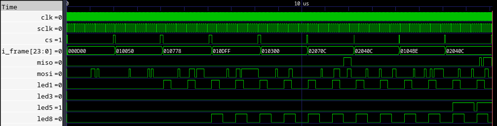

# simple-spi
## Overview
This project implements SPI-based communication between a microcontroller and an FPGA. 

The microcontroller acts as an SPI master and sends commands to an FPGA which servers as a slave. The commands are:

- light up/down an LED (by specifying brightness level)
- get LED status

FPGA in return sends back responses describing its action.

## Data frames
In order to meet specifications of [ESP32 SPI master drivers](https://docs.espressif.com/projects/esp-idf/en/stable/esp32/api-reference/peripherals/spi_master.html) both master and slave data frames were designed to meet the constraints enforced by the documentation.

The documentation defines a transaction as a singular act of asserting the CS line -> transferring data back and forth -> deasserting CS. Withing a single transaction the following states were described:

- ```command```: defining type of command: read/write
- ```address```: defining address of read/write register
- ```dummy```: extra meaningless bits issued to meet clock constraints
- ```read```: read operation
- ```write```: write operation

Data should be 32 bits compliant to nicely reasonate with ESP32 architecture. The documentation indicates that by default ```uint8_t``` is used and data that has to be sent which is less than 8 bit will be sent as 8 bit chink regardless with some garbage bits after the LSB (The proper data should start at the MSB of this 8 bit chunk). Each portion comprises of 8 bits for an ease of decoding, thus an entire daat frame is 24 bit long.


SPI Master Data Frame

Slave's response data frame deals only with the brightness status. No extra addressing is required as the master knows which LED brightness status it requested. Nonetheless, to keep the format the payload is still packed in the 24 bit long data frame, where the payload occupies the last 8 bits (the first 16 bits are 0).


SPI Slave Data Frame

## Implementation
The implementation can be divided into C and HDL part, where the FPGA part was implemented with Verilog.

### FPGA
Within ```src/hdl/``` modules implementing both slave and master are located. SPI Master was implemented in Verilog in order to emulate ESP32 behavior.

#### SPI Master- FPGA
FPGA implementation of SPI Master is governed by the FSM which follows the transaction model defined inside EPS32 SPI Masster Driver documentaion. It consists of 5 states. The middle 3 states: ```COMMAND```, ```ADDRESS```, ```READ/WRITE``` consume data frames. This project utilizes an user available SPI2 which is a general-purpose SPI for ESP32, here it assumes one slave only. The clock selected to drive the testbench is 26MHz and it corresponds to full-duplex EPS32 SPI Master capability using GPIO Matrix Pins.


SPI Master FSM

#### SPI Slave- FPGA
FPGA implementation of SPI Slave is the synthesizeable module governed by FSM similar to the one present for ***SPI Master- FPGA***. 

The modification in regard to ```spi_master_mock``` is the register-file which stores LEDs brightness level. Each field in the register-file is dedicated to a separate LED. Moreover, each field drives different PWM which is also exclusive to a single LED. A change in a field of the register-file causes the output signal from a particular PWM to change.

The slave supports full-duplex transactions. This is possible thanks to collaborative nature between two modules: ```spi_top``` and ```spi_slave```.
```spi_top``` is the principal module which initializes both ```pwm``` and ```spi_slave```. It interprets commands, which ```spi_slave``` receives.
The commands could be:

- ```CMD_LED_SET```: sets LED brightness; due to the need of receiving an entire data frame (command + address + payload) at the end of the transaction ```spi_slave``` triggers ```rx_dv``` to signal that the data frame has been captured so ```spi_top``` can reasign proper field in LEDs register-file, which drives ```pwm```. In meantime slave sends back an empty data frame (```24'b0```).
- ```CMD_LED_READ```: sends back selected LED brightness level; This logic is more complex because first 16 bits of the return transmission of the slave are still 0, however the last 8 have to be proper payload. ```spi_slave``` immediately intercepts received command and address whenever they are valid and triggers ```rd_bypass``` (read bypass) and ```rx_addr_dv``` (received address is valid) so ```spi_top``` can replace the last 8 bits which ```spi_slave``` will send with the value from LEDs register-file.
- ```CMD_NOP```: no action.

### SPI wiring
The wiring between SPI Master and SPI Slave is represented on the digram below. It makes use of default SPI2 pins of ESP32-S3 and PMOD pins of Xilinx Zybo Z7-20.


For PMOD reference check ```src/constraints/Zybo-Z7-Master.xdc```.
For ESP32-S3 pinout [check here](https://docs.espressif.com/projects/esp-dev-kits/en/latest/esp32s3/esp32-s3-devkitm-1/user_guide.html#related-documents).

## Hardware
This project makes use of:

- [ESP-32-S3 DevKitM1](https://docs.espressif.com/projects/esp-dev-kits/en/latest/esp32s3/esp32-s3-devkitm-1/index.html)
- [Xilinx Zybo Z7-20](https://digilent.com/shop/zybo-z7-zynq-7000-arm-fpga-soc-development-board/)
- set of LEDs
- OLED display
- gauge

## Build
In order to generate bitstream and netlist execute:
```
make build
```

Programming the device is done with:
```
make program_fpga
```

In order to customize this implementation please adjust project's section of Makefile:
```Makefile
# Project's details
project_name    := simple_spi
top_module          := spi_top
language            := verilog
device              := xc7z020clg400-1 # use device specific name
```

Don't forget to provide your own ```.xdc``` file to ```src/constraints/``` directory.

## Simulation
Running simulations is also possible. All testbenches have to be stored inside ```src/sim/```.

Tesbenches can be either run all or selected.
To run all of them:
```
make sim_all
```

To run selected:
```
make sim_sel TB="uart_top_tb uart_rx_tb ..."
```

Results will be stored inside ```simulation/waveforms``` directory that will be created during the first run of make.

### Simulation results
In order to validate SPI Slave module that works with an actual ESP32 a non-synthesizeable SPI Master emulating ESP32 SPI Master driver was implemented in Verilog as well. The FPGA implementation of SPI Master followed timing constraints of master clock issued by ESP32 (26MHz) and SPI mode (mode 0). Established data frames were exchanged by both master and slave to mimick real world communication. Messages coming from the master were used by the slave to drive PWM module, while slave responses were reporting selected LEDs status.



The following waveforms were obtained from ```src/sim/spi_top_tb.v```. 
Signals:

- ```sclk```
- ```cs```
- ```i_frame```: master data frame
- ```mosi```

Were generated by the SPI Master mock-up, while:

- ```miso```
- ```led1```, ```led3```, ```led5```, ```led8```: PWM outputs

Were generated by the SPI Slave. 

## Closing
If you enjoy this project's structure and build system please check my other [project](https://github.com/szymek1/FPGA-TCL-Makefile-template).
